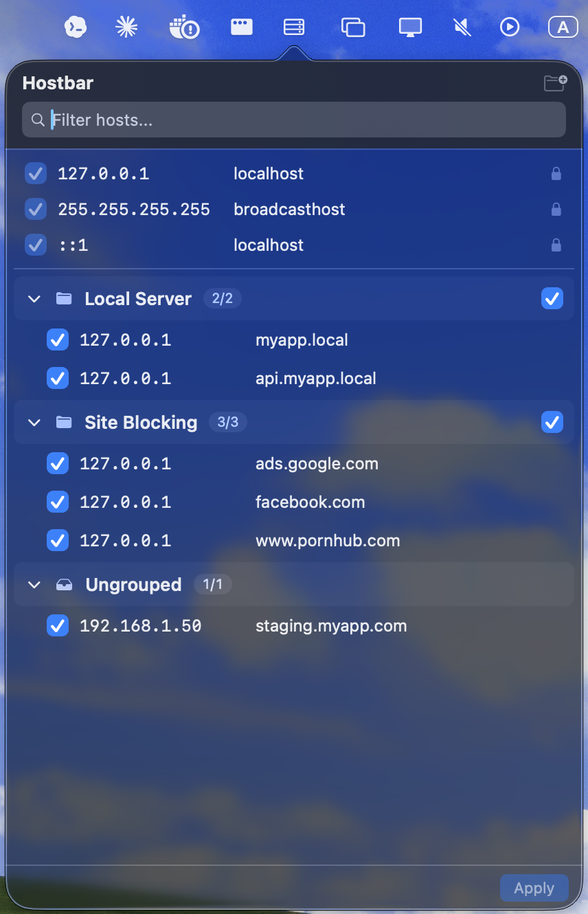
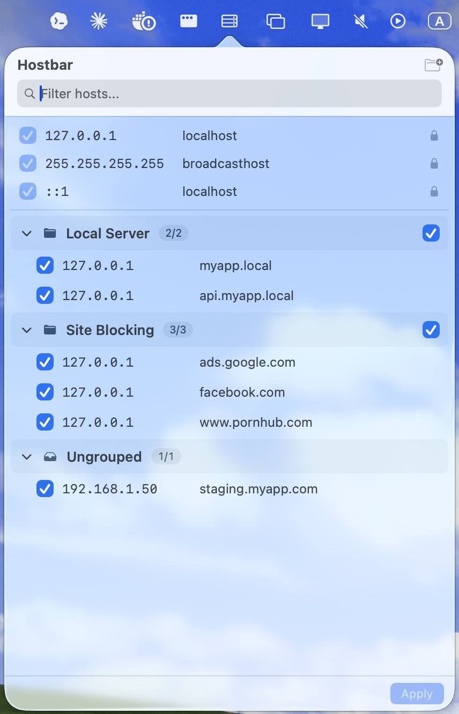
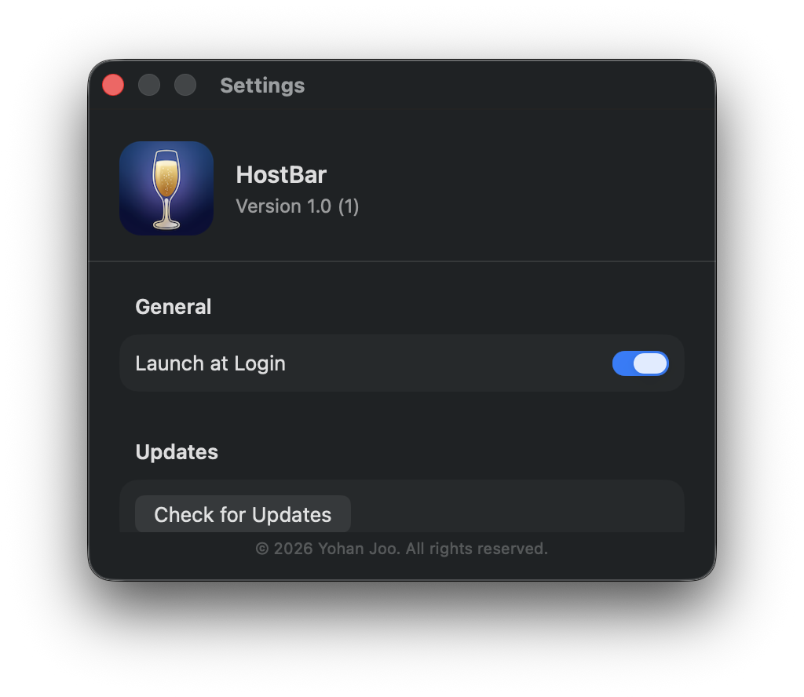

# HostBar 🥂

HostBar is a macOS menu bar utility that allows you to manage your `/etc/hosts` file quickly and easily. It provides a sleek, native interface to control host settings without the need for terminal commands or manual text editing.

## Key Features

- **Host Management**: Effortlessly add, edit, and delete host entries.
- **Grouping**: Organize host settings into groups for better management. You can also rename groups as needed.
- **One-Click Toggle**: Quickly enable or disable specific hosts or entire groups using simple checkboxes.
- **Search & Filtering**: Find specific domains or IP addresses instantly using the top filter bar.
- **System Protection**: Critical system hosts like `localhost` are protected with a lock icon to prevent accidental changes.
- **Group Status**: At a glance, see how many hosts are active within each group (e.g., 2/2).
- **Apply Changes**: All modifications are safely applied to the system only when you click the 'Apply' button.
- **Menu Bar Interface**: A lightweight app that lives in your menu bar for instant access anytime.
- **Native Design**:
    - Full support for **Light and Dark modes**, following your macOS system settings.
    - Clean and modern interface built with SwiftUI.
- **Launch at Login**: Option to automatically start the app when you log into your Mac.

## Screenshots

| Dark Mode | Light Mode | Settings |
| :---: | :---: | :---: |
|  |  |  |

## Requirements

- **OS**: macOS 13.0 (Ventura) or later recommended.
- **Permissions**: Administrator privileges are required to modify the `/etc/hosts` file.

## Installation

You can easily install HostBar via [Homebrew](https://brew.sh/):

```bash
brew tap shield41791/tap
brew install --cask hostbar
```

## How to Use

1. **Add Host**: Click the `+` button at the top right or the add button within a group to register a new host.
2. **Manage Groups**: Click the new folder icon to create a group and organize your hosts.
3. **Apply**: After making changes, click the `Apply` button at the bottom to save them to the system.
4. **Search**: Use the filter bar at the top to search for specific domains or IPs.

## License

Released under the [MIT License](LICENSE).
© 2026 Yohan Joo.